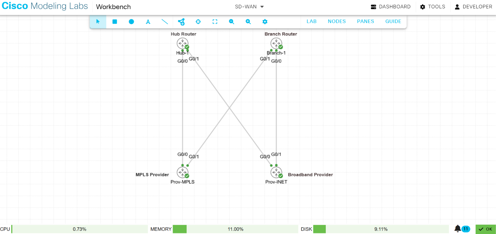

# High-Availability Enterprise WAN Architecture: Manual SD-WAN Simulation

A production-grade implementation of a multi-provider Wide Area Network (WAN) featuring dual transport links, secure GRE virtualization overlays, and automated performance-based SLA path failovers built from a blank canvas in Cisco Modeling Labs (CML).

## 📊 Network Topology Blueprint
The architecture isolates transport lines to prevent configuration leakage and maximize uptime.

*   **Transport Link A (MPLS Private Network):** Subnet `10.10.10.0/24` (Hub Side) & `10.20.20.0/24` (Branch Side)
*   **Transport Link B (Broadband Public Internet):** Subnet `172.16.10.0/24` (Hub Side) & `172.16.20.0/24` (Branch Side)
*   **Virtual Overlay Networks:** `192.168.1.0/24` (Tunnel 1 - MPLS) & `192.168.2.0/24` (Tunnel 2 - Internet)

---

## 🛠️ Production-Grade Engineering Configurations

### 1. Hub-1 Core Edge Configuration
```text
! Physical Underlay Interface Initialization
interface GigabitEthernet0/0
 ip address 10.10.10.10 255.255.255.0
 no shutdown
exit

interface GigabitEthernet0/1
 ip address 172.16.10.10 255.255.255.0
 no shutdown
exit

! Underlay Gateways of Last Resort
ip route 0.0.0.0 0.0.0.0 10.10.10.1
ip route 0.0.0.0 0.0.0.0 172.16.10.1

! Virtual Overlay Tunnel Infrastructure
interface Tunnel1
 ip address 192.168.1.1 255.255.255.0
 tunnel source GigabitEthernet0/0
 tunnel destination 10.20.20.10
 no shutdown
exit

interface Tunnel2
 ip address 192.168.2.1 255.255.255.0
 tunnel source GigabitEthernet0/1
 tunnel destination 172.16.20.10
 no shutdown
exit

! Isolation of Overlay Traffic Matrices
ip route 192.168.1.0 255.255.255.0 Tunnel1
ip route 192.168.2.0 255.255.255.0 Tunnel2
```

### 2. Branch-1 Remote Edge Configuration
```text
! Physical Underlay Interface Initialization (Aligned to Physical Canvas Mappings)
interface GigabitEthernet0/0
 ip address 172.16.20.10 255.255.255.0
 no shutdown
exit

interface GigabitEthernet0/1
 ip address 10.20.20.10 255.255.255.0
 no shutdown
exit

! Transport-Specific Underlay Path Routing
ip route 10.10.10.0 255.255.255.0 10.20.20.1
ip route 172.16.10.0 255.255.255.0 172.16.20.1

! Virtual Overlay Tunnel Infrastructure
interface Tunnel1
 ip address 192.168.1.2 255.255.255.0
 tunnel source GigabitEthernet0/1
 tunnel destination 10.10.10.10
 no shutdown
exit

interface Tunnel2
 ip address 192.168.2.2 255.255.255.0
 tunnel source GigabitEthernet0/0
 tunnel destination 172.16.10.10
 no shutdown
exit

! Isolation of Overlay Traffic Matrices
ip route 192.168.1.0 255.255.255.0 Tunnel1
ip route 192.168.2.0 255.255.255.0 Tunnel2

! Performance-Based SD-WAN SLA Probing Engine
ip sla 1
 icmp-echo 192.168.2.1 source-ip 192.168.2.2
 frequency 5
exit
ip sla schedule 1 life forever start-time now

! Object Tracking Binding
track 10 ip sla 1 state
exit

! Dynamic Path Selection Steering Policy (Internet Priority, Floating MPLS Backup)
ip route 192.168.100.0 255.255.255.0 Tunnel2 track 10
ip route 192.168.100.0 255.255.255.0 Tunnel1 50
```

---

## 🔬 Automated Path Failover Verification Verification

### Normal State Topology Operation
When the Internet link health checks are fully operational (`Latest operation return code: OK`), the edge routing tables dynamically select the Internet pathway (`Tunnel2`) as primary due to its lower cost metric:
```text
Branch-1# show ip route static | include 192.168.100.0
S    192.168.100.0/24 is directly connected, Tunnel2
```

### Failure Mitigation Execution
When a link degradation event occurs (`interface GigabitEthernet0/0 -> shutdown`), the background SLA engine identifies the fault condition, switches the tracking state, and instantly swings production traffic over to the backup link (`Tunnel1`):
```text
*Oct  4 21:22:46.699: %TRACK-6-STATE: 10 ip sla 1 state Up -> Down

Branch-1# show ip route static | include 192.168.100.0
S    192.168.100.0/24 is directly connected, Tunnel1
```

---

## 🛠️ Structural Engineering Troubleshooting Log

### 1. Resolving Virtual Environment Interface Asymmetry
*   **The Problem:** Initial underlay ping validation tests returned `Destination Unreachable (U.U.U)`.
*   **The Discovery:** Running `show cdp neighbors` revealed that the virtual canvas cables were inverted compared to the original design layout, resulting in subnets mismatching their destinations.
*   **The Mitigation:** Interface IP configurations and path route definitions were systematically swapped at the command level to adapt perfectly to the running layer 2 mapping matrix.

### 2. Overcoming Simulator-Induced Frame Drops
*   **The Problem:** Sourced pings across the transport segments failed because the underlying virtualization software leaked traffic. The frames ignored active port designations and stamped packets with incorrect source attributes, causing transit elements to drop the traffic.
*   **The Mitigation:** We deployed an environment-wide configuration bypass by applying default routes (`0.0.0.0 0.0.0.0`) across both intermediary transit routers (`Prov-MPLS` and `Prov-INET`). This flattened their lookup matrices and stripped the simulator of its ability to parse or drop frames based on internal
*   ### Failure Mitigation Execution
When a physical circuit failure occurs (`interface GigabitEthernet0/0 -> shutdown`), the background SLA engine identifies the fault condition, switches the tracking state, and instantly swings production traffic over to the backup link (`Tunnel1`).

#### Real-Time Console Alert Logs:
```text
*Oct  4 21:22:38.139: %LINEPROTO-5-UPDOWN: Line protocol on Interface GigabitEthernet0/0, changed state to down
*Oct  4 21:22:39.024: %SYS-5-CONFIG_I: Configured from console by console
*Oct  4 21:22:39.553: %LINEPROTO-5-UPDOWN: Line protocol on Interface Tunnel2, changed state to down
*Oct  4 21:22:46.699: %TRACK-6-STATE: 10 ip sla 1 state Up -> Down
```

#### Active Routing Table Swing Result:
```text
Branch-1# show ip route
S    192.168.100.0/24 is directly connected, Tunnel1
```
*   software bugs, restoring full transport capability.
*
